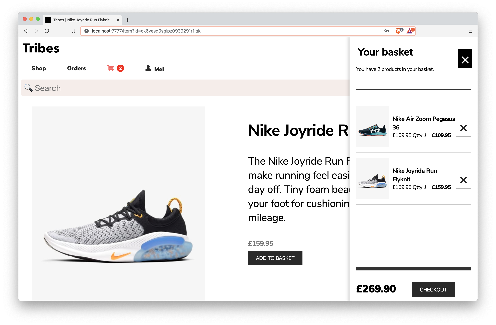
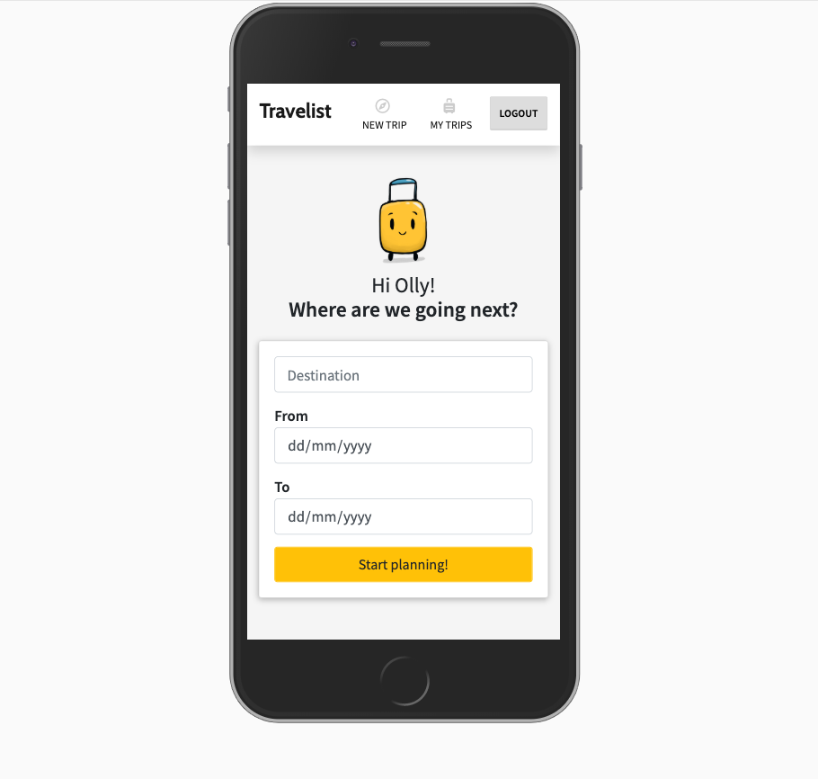
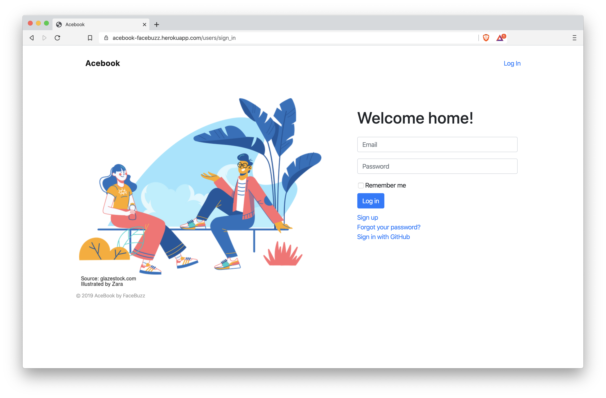
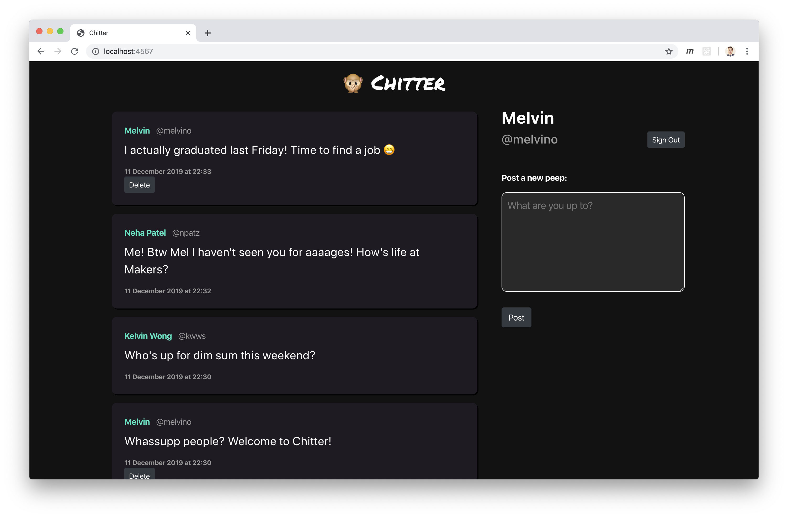

<h1 align="center">Melvin Lau</h1>

<h3>Front-End / Full-Stack Software Developer</h3>

[About Me](#about-me) &nbsp;  &nbsp; [Projects](#projects) &nbsp;  &nbsp; [Skills](#skills) &nbsp;  &nbsp; [Education](#education) &nbsp;  &nbsp; [Experience](#experience) &nbsp;  &nbsp; [Interests](#interests)

&nbsp;

## About Me

I'm a software developer (and a chartered structural engineer) currently working with `React`, `NodeJS`, `Ruby on Rails` and `Python`/`Django`.   

Inspired by the work of creative agencies, I self-learned `HTML`/`CSS` and `JavaScript` at 13 to design a personal blog, and went on to help friends build a business website using `Flash`/`ActionScript` while studying Civil Engineering. Now, after a decade of structural engineering &mdash; a career I am proud of nonetheless &mdash; I realised that my true passion lies in Tech. I wanted more room to innovate, and thus embarked on a career change to become a software developer.   

Self-driven, self-learning and a recent graduate of software craftsmanship at **[Makers Academy](https://www.makers.tech)**, I'm looking for a role where I can collaborate with awesome people to turn great ideas into exciting digital products.

&nbsp;

## Projects

| Project Details  | Preview |
|:----------|:----------:|
| <h3>Tribes </h3>  <h4>Freelance Project (Work In Progress)</h4>
I'm currently building an e-commerce platform that will not only enable online purchases, but also manage order fulfilment and optimise production schedules on the supplier backend. Server-side rendering (SSR) with React+Next.js is used to improve SEO and user experience.
<h4>Tech Stack</h4>
`React (Hooks)` `Next.js` `NodeJS` `Apollo` `GraphQL` `Prisma` `Stripe`
<h4>Testing Frameworks</h4>
`Jest` `Enzyme`
 | 
   [View interim demo (limited features)](https://tribes-demo.now.sh) 
|   
| <h3>[Travelist](https://github.com/melvinlau/travelist)</h3> <h4>Team Final Project at Makers</h4> 
Travelist helps you to pack effectively for upcoming trips. You describe your itinerary, and Travelist will recommend you a list of items to pack based on the weather forecast and your planned activities. You can then personalise your list and track your packing progress.
 <h4>Tech Stack</h4> 
`MongoDB` `Express` `React (Hooks)` `NodeJS` `HTML` `CSS`
 <h4>Testing Frameworks</h4> 
`Cypress` `Jest` `Enzyme`
 | 
   &nbsp; [View the live demo.](https://travelistmakers.herokuapp.com/)   
 |  
| <h3>[AceBook](https://github.com/melvinlau/acebook-facebuzz)</h3> <h4>Team Engineering Project at Makers</h4> 
AceBook is a social network where users can connect by posting messages and uploading images on each other's walls. AceBook was developed according to the instructions of a Makers technical coach acting as the client.
 <h4>Tech Stack</h4> 
`PostgreSQL` `Ruby on Rails` `HTML` `CSS`
 <h4>Testing Frameworks</h4> 
`RSpec` `Capybara`
 | 
    [View the live demo.](https://acebook-facebuzz.herokuapp.com)   &nbsp; 
 |   
| <h3>[Chitter](https://github.com/melvinlau/chitter-challenge) </h3> <h4>Individual Project </h4>
Chitter is a web app that allows users to register, sign in and post short messages ('peeps') to a public feed. It mimics the basic functionality of Twitter.
 <h4>Tech Stack</h4> 
`PostgreSQL` `Ruby` `Sinatra` `HTML` `CSS`
 <h4>Testing Frameworks</h4> 
`RSpec` `Capybara`
 | 
   &nbsp; 
 |

&nbsp;

## Skills   

#### Self-driven  

I believe that I can achieve anything I put my mind to. One of my biggest goals as a structural engineer was to achieve chartered status, which demonstrates an all-rounded and high level of competence in the profession. Early in my career, I was declined a place in the graduate training scheme due to not meeting the academic criteria for chartership. To overcome this, I proactively sought corporate sponsorship to study an MSc, organised CPD activities within my organisation and self-managed my professional development outside the training scheme to become a [Chartered Engineer](https://www.engc.org.uk/ceng) in 2016. Similarly, I am confident in my abilities and resourcefulness to succeed as a software developer.  

#### Fast learner   

At Makers Academy, I picked up programming concepts quickly and helped others to do the same. I've been recognised for teaching my coursemates to debug and solve technical challenges. During the team projects, I was particularly good at understanding `React` and helped to upskill the team by giving a team workshop on it. In addition, I actively mentor members of junior cohorts to help them fare better in the course with some of my lessons learned.   

#### Team player   

I developed the skill of pair programming at Makers Academy. This enabled me to communicate technical ideas effectively with developers from diverse backgrounds and varying levels of experience. As I switched pair partners every day, I trained myself to deal with different personality types, exchanging feedback regularly to improve self-awareness. I also developed software projects collaboratively in Agile teams of 4-6 developers. As the Scrum Master for a number of sprints, I facilitated planning sessions as well as daily stand-ups and retrospectives to keep the team aligned.  

#### Problem-solver   

I built a reputation at [Transport for London](https://www.tfl.gov.uk) for solving construction problems within the [Four Lines Modernisation](https://www.tfl.gov.uk/travel-information/improvements-and-projects/four-lines-modernisation) programme. On several occasions, cable support systems were either incorrectly installed or could not be installed as-designed due to site constraints. I was able to liaise with design and construction teams, perform engineering assessments and provide solutions quickly on-site, which resulted in substantial team progress with the cable installation.

#### Analytical thinker   

As a structural engineer, I successfully analysed complex problems such as the capacity of offshore structures to withstand extreme waves and accidental blast.  On multiple projects I was able to apply a methodical workflow, leveraging software and scripting for advanced structural simulations, whilst independently verifying and interpreting the result data in order to advise clients on OPEX decisions.    

&nbsp;

## Education   

**[Makers Academy](https://www.makers.tech)** (September &mdash; December 2019)   
**Software Development**

- Object-oriented programming
- Test-driven development (TDD)
- Model-View-Controller (MVC) architecture
- Agile/XP practices
- `Ruby`, `Rails`, `JavaScript`, `React`, `JQuery`
- `RSpec`, `Capybara`, `Jasmine`, `Jest`, `Enzyme`, `Cypress` test frameworks

**[University of Aberdeen](https://www.abdn.ac.uk)** (2012 &mdash; 2015)   
**MSc Oil and Gas Structural Engineering**   

**[Universiti Teknologi Petronas](https://www.utp.edu.my)** (2005 &mdash; 2009)   
**BEng Civil Engineering**   

- Head of Publishing, Engineering Design Exhibition 2006: Led design projects using `Photoshop` and `Illustrator`
- Final project: Simulation of wave loads on an offshore structure using `MATLAB` programming

&nbsp;

## Experience

**[Energystructures](http://www.energystructures.com)** (April 2016 &mdash; Present)   
**Founder & Engineering Consultant**   

I was responsible for the delivery of engineering and analytical workscopes for oil and gas, renewables and rail infrastructure. Notable clients include [Optimus Aberdeen](https://www.optimusaberdeen.com) (2018-2019, energy sector) and [Transport for London](https://www.tfl.gov.uk) (2017-2018, rail sector).

- I studied the structural behaviour of a ship and a blast-loaded module using advanced finite element analysis software ([Sesam](https://www.dnvgl.com/software/products/sesam-products.html) and [Abaqus](https://www.3ds.com/products-services/simulia/products/abaqus/)) using `JavaScript` and `Python` scripting to automate the analysis workflow.

- I helped energy contractors overcome marine lifting and installation constraints by designing modularised structures that could be transported separately but hooked up as an integrated unit after installation.

**[McDermott](https://www.mcdermott.com/)** (October 2011 &mdash; January 2017)   
**Structural Engineer**    

Working in a team, I successfully delivered high-quality and timely structural designs for the new Mariner, Montrose BLP and Clair Ridge offshore installations in the UK North Sea. I optimised the team's workflow by developing `Excel VBA` macros to automate the screening of analysis results and significantly reduced the manual calculations that followed.

I was responsible for design coordination across teams and third-party interfaces on the Mariner and BP SCPX projects.

**[DNV GL](https://www.dnvgl.com)** (October 2009 &mdash; October 2011)   
**Structural Engineer**   

I carried out 3D computer modelling, analysis and engineering assessments to support the maintenance and life extension of offshore structures. I was also responsible for liaising with clients (energy operators) and working with their personnel on-site in Abu Dhabi and Trinidad to carry out structural surveys.   

&nbsp;

## Interests

- **Food**: I love discovering food from all over the world, and I enjoy cooking (signature dish: Salmon risotto di Melvino)   
- **Personal development**: I'm an avid reader of management/entrepreneurial books and am continually developing myself
- **Sailing**: I'm [Day Skipper](https://www.rya.org.uk/courses-training/courses/sail-cruising/Pages/day-skipper.aspx)-qualified, occasionally teaming up with ex-colleagues to compete in the [Engineering Challenge Cup](https://www.ecc-sailing.com)
